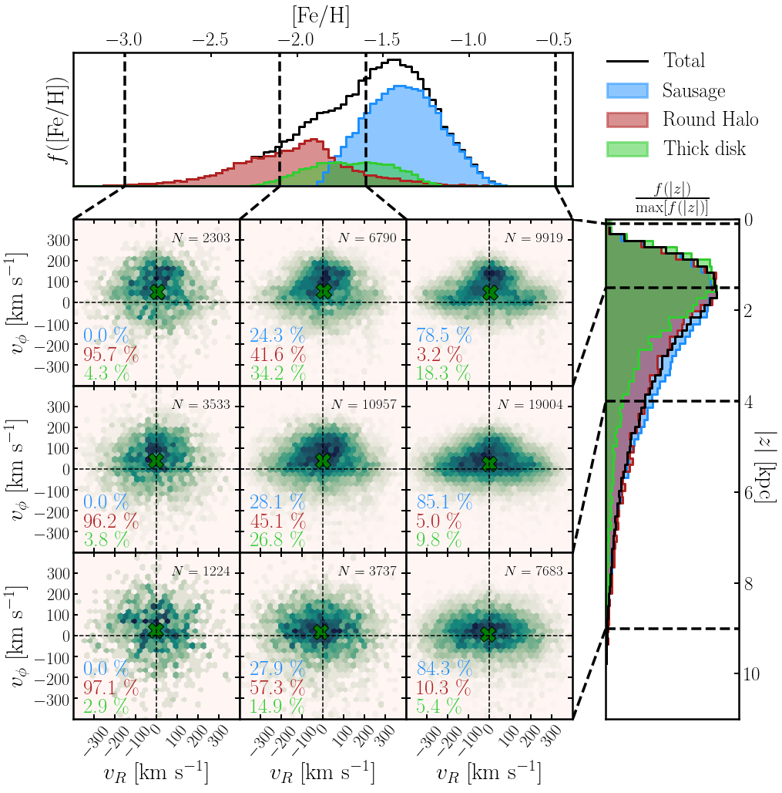
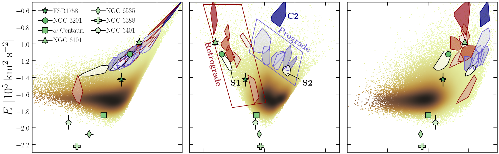
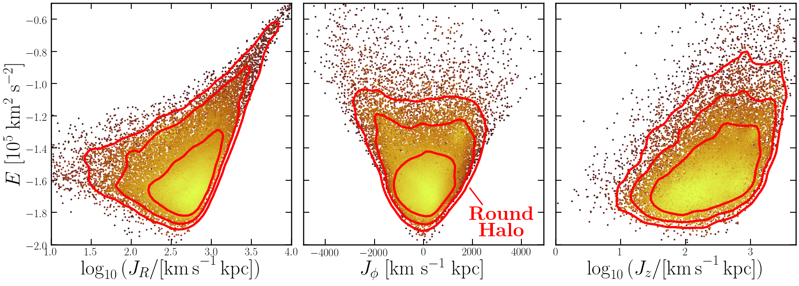
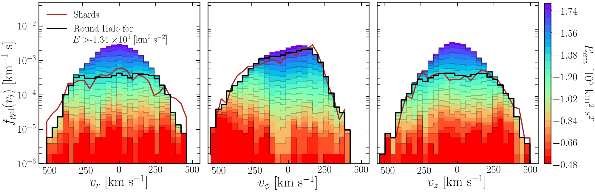
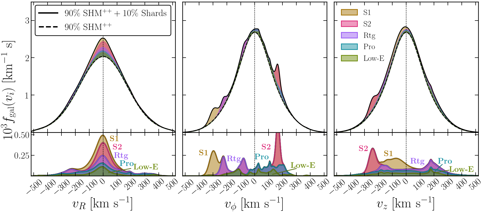
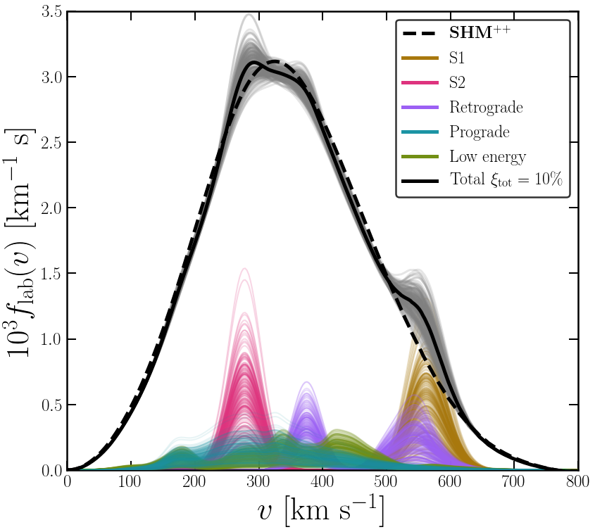
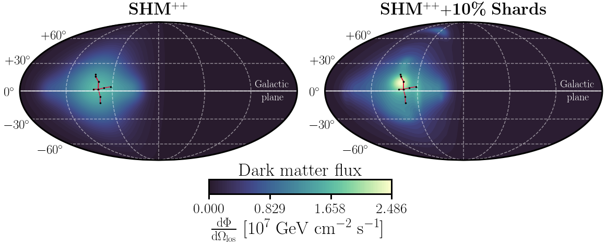
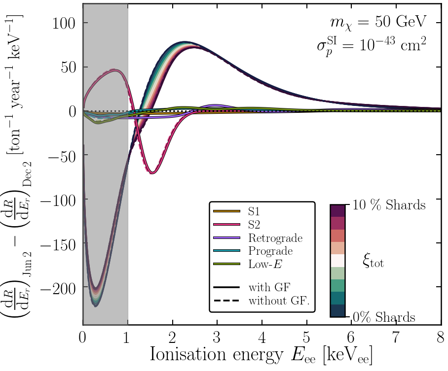
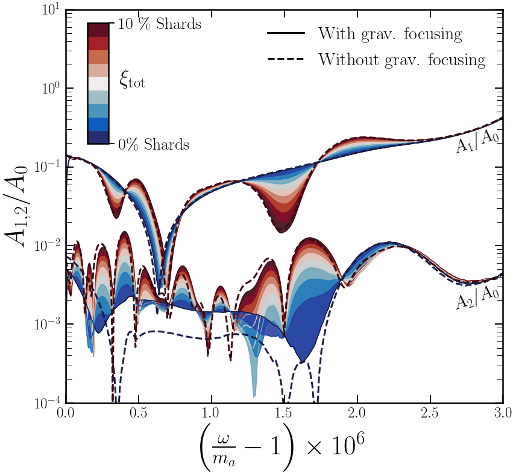

# DarkShards

[//]: 

This repository contains the code, data and notebooks for (one hopes) reproducing the entirety of our recent paper "*Dark Shards*". There are also a few results and bits and pieces which did not make it in to final version but I've left in for potential future interest. In case you're interested in a particular plot see below for a list of various plots and the links to the specific notebook that makes it.

Please contact me at ciaran.aj.ohare@gmail.com if you want to winge about why something doesn't work.

## Contents

The code, plots, datas, etc. are sorted as follows:

* `data/` - Contains the *Gaia* sample of halo stars as well as various cleaned samples of the same data and the extracted substructures and fits.
* `code/` - Notebooks and python files which spit out various plots and other results that can be found in the paper
* `plots/` - plots get put here in pdf and png formats.
* `movies/` - A few movies just for visualising the halo sample etc.

## Requirements

The code is all written in python3 and makes substantial use of the standard numpy, matplotlib, scipy etc. There are several additonal libraries that you may need to investigate depending on your installation:

* [`astropy`](https://www.astropy.org/), used for various things and also required by ...
* [`galpy`](https://galpy.readthedocs.io/en/v1.4.0/), used for computing stellar orbits
* [`scikit-learn`](https://scikit-learn.org/stable/), used in fitting the shards and doing kernel density estimates for action space variables
* [`cmocean`](https://matplotlib.org/cmocean/), nice aesthetic colormaps that don't just look like a unicorn's vomit
* [`cartopy`](https://scitools.org.uk/cartopy/docs/latest/), used to make Mollweide skymaps
* [`healpy`](https://healpy.readthedocs.io/en/latest/), can't remember what this was used for but it's there

## License

This project is licensed under the MIT License - see the [LICENSE.md](LICENSE.md) file for details

---

# The Results
Here is each figure in the paper in order

## Fig. 1

[Click here for the notebook](https://github.com/cajohare/DarkShards/blob/master/code/Plot_ThreeComponentHalo.ipynb)

---

## Fig. 2

[Click here for the notebook](https://github.com/cajohare/DarkShards/blob/master/code/Plot_Actions_decomp.ipynb)

---

## Fig. 4

[Click here for the notebook](https://github.com/cajohare/DarkShards/blob/master/code/Plot_comparespeeddists_halo.ipynb)

---

## Fig. 5

  
  

  
  

[Click here for the notebook](https://github.com/cajohare/DarkShards/blob/master/code/Stars_GenerateAllPlots.ipynb)

---

## Fig. 6

[Click here for the notebook](https://github.com/cajohare/DarkShards/blob/master/code/Stars_GenerateAllPlots.ipynb)

---

## Fig. 8

[Click here for the notebook](https://github.com/cajohare/DarkShards/blob/master/code/Plot_SpeedDistributions.ipynb)

---

## Fig. 9

[Click here for the notebook](https://github.com/cajohare/DarkShards/blob/master/code/plot_Skymaps.ipynb)

---

## Fig. 10

[Click here for the notebook](https://github.com/cajohare/DarkShards/blob/master/code/Plot_Skymaps.ipynb)

---

## Fig. 11

[Click here for the notebook](https://github.com/cajohare/DarkShards/blob/master/code/Plot_axionspectrum.ipynb)

---

## Fig. 12

[Click here for the notebook](https://github.com/cajohare/DarkShards/blob/master/code/Plot_NRdists.ipynb)

---

## Fig. 13

[Click here for the notebook](https://github.com/cajohare/DarkShards/blob/master/code/Plot_DAMAShards.ipynb)

---

## Fig. 14

[Click here for the notebook](https://github.com/cajohare/DarkShards/blob/master/code/Plot_DAMAShards.ipynb)

---

## Fig. 15

[Click here for the notebook](https://github.com/cajohare/DarkShards/blob/master/code/Plot_DirectionalNR.ipynb)

---

## Fig. 16

[Click here for the notebook](https://github.com/cajohare/DarkShards/blob/master/code/Plot_DirectionalNR.ipynb)

---

# Bonus plots

## Comparisons of stellar halo and Shards

  
  

[Click here for the notebook](https://github.com/cajohare/DarkShards/blob/master/code/Plot_EnergyMetallicity.ipynb)

---

## Annual modulation harmonic analysis

  
  

[Click here for the notebook (left)](https://github.com/cajohare/DarkShards/blob/master/code/Plot_StreamFourierSeries.ipynb)

[Click here for the notebook (right)](https://github.com/cajohare/DarkShards/blob/master/code/Plot_StreamFourierSeries2.ipynb)

---
